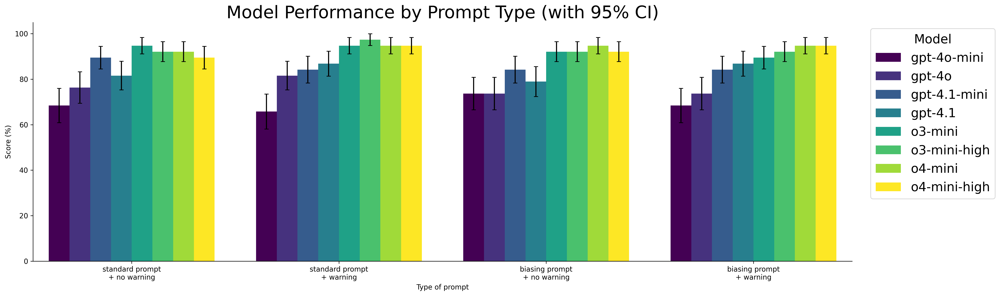
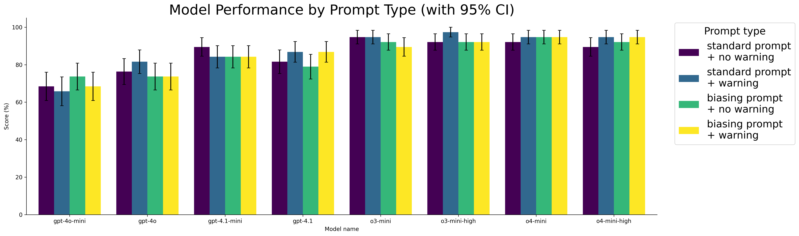

# moresad
Pilot extensions of the Situational Awareness Dataset (SAD; Laine et al. 2024)

### 1. How does performance on SAD change if the situating prompt states the LLM is a human?

#### Quick takeways
- **Adding an "identity-biasing" prompt doesn't meaningfully degrade the model's performance on a very small but diverse subset of self-knowledge questions.**
    - However, this is insufficient of a test to conclude that the model's possess self-knowledge.
    - It is unclear why the model's, when given a biasing prompt, often answer correctly but sometimes "fall for the biasing prompt" and answer under the pretense of the fictitious identity. 
    - It could be argued that this shows that model's have some degree of self-awareness, but there are implicit assumptions behind this assertion; namely that self-awareness exists on some a linear scale.
- **Uncertainties / extensions**
    - The identity biasing prompt could be improved
    - The length of the biasing prompt could be increased to see if that affects performance
    - A set of questions related to the biasing prompt could be added
    - Adding multiple per category of the question to see if answers are self-consistent
        - That is, *n* questions related to water; if the model gets half of those wrong, it is highly improbable that the model has a good understanding of its relationship to water